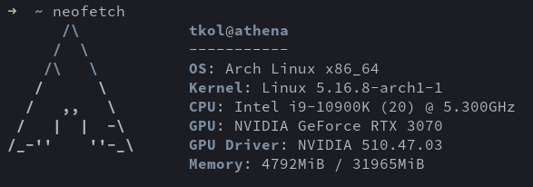
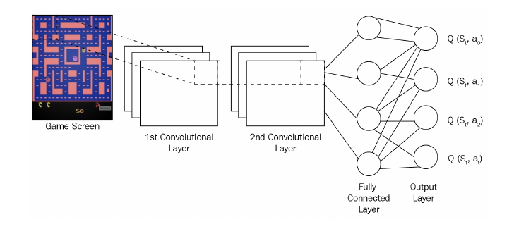

<H1 align="center">
Playing Super Mario Bros with the Double Deep Q Learning algorithm
<br>
</H1>

<p align="right"> Giorgio Strano - 1809528 </p>
<p align="right"> Machine Learning course  2021/2022</p>
<br>

### **Index:**

- ### Introduction, aims and goals
  
- ### Technologies and hardware

- ### Basics of Q learning
  
- ### The double deep Q algorithm

- ### Implementation

- ### Results and conclusions

- ### References

- ### Related links

<br>
<br>

# Introduction, aims and goals


For this machine learning project, I decided to give my best shot at the implementation of an algorithm that has fascinated me for a long time, and that I consider to be one of the most elegant and intriguing algorithms in the field of reinforcement learning: the Double Deep Q algorithm.

I first discovered this algorithm many years ago, but I tried to understand it way before I had any of the sufficient knowledge to do so. Years later I discovered *Gym*, by *OpenAI*, which is an amazing framework for developing and testing RL algorithms.

In the words of the authors,
> Gym is a toolkit for developing and comparing reinforcement learning algorithms.
> 
> The gym library is a collection of test problems — environments — that you can use to work out your reinforcement learning algorithms. These environments have a shared interface, allowing you to write general algorithms.

This framework relit my curiosity for reinforcement learning, and led me to learn and implement a few basic algorithms, from random searches, to hill-climbing and simple policy gradient methods. The obvious next topic, that until now I did not have a chance to explore yet, was deep Q learning and the double deep Q version.

I intend to understand, implement, train and test the algorithm, to experience how it behaves and how it can perform in a complex videogame environment. The final goal is to train it to beat a level of the classic Super Mario Bros game.

<br>
<br>

# Technologies and hardware

The code for this project will be written in python 3.8, using the [PyTorch](https://pytorch.org/) framework, which supports GPU acceleration with CUDA.

The game environment will be handled by [OpenAI Gym](https://gym.openai.com/), which offers an environment interface that takes care of modelling the state, modelling and executing the actions, the visual rendering of the game, and computing the rewards given. In particular, the environment for the Super Mario Bros game is from a third party and can be found at its [public GitHub repository](https://github.com/Kautenja/gym-super-mario-bros).

The model will be trained and tested on my local machine, which uses an Intel Core i9 10900k processor and an NVIDIA RTX3070 gpu.



All the dependencies are listed in the `environment.yml` file, and the conda environment can be created with: 
```
conda env create -f environment.yml
```

My goal is to provide an implementation that is concise, simple and object-oriented, and most importantly easy to understand, to tweak and to extend. Each structural component of the algorithm is stored in its own file, and the two main classes, the environment class and the agent class, offer an abstract interface that makes the project modular and easy to extend with different learning algorithms or different environments.

All of the code included is written by me, taking as guidance some of the sources mentioned at the end of this report, with the exception of the code contained in the files `wrappers.py` and `logger.py`, whose respective sources are mentioned at the beginning of the files.

Brief instructions to train and test the model are included in the last lines of the `main.py` file.


<br>
<br>

# Basics of Q learning

Before explaining the Double Deep Q algorithm, I belive it is important to take a step back and understand its origins and the core concepts behind Q learning. I will try to give an overview of a few basic topics of reinforcement learning that are fundamental to understand the following ones, starting from its origin with TD learning. I will not go too deep in the details of each one, to keep this section clear and concise, so a basic knowledge of reinforcement learning will be assumed.

<br>

## Temporal Difference Learning

The Temporal Difference (TD) learning algorithm was introduced by Sutton in 1988. Its main idea is to *predict a quantity that depends on future values of a given signal*. In the context of reinforcement learning, where we try to predict some value, this means to approximate the current estimate based on the previously learned ones.

<br>

## TD prection

In **TD prediction**, the value we try to predict is the value $V(s)$ of a given state $s$. TD learning uses in this case the following update function:

$V(s) := V(s) + \alpha (r + \gamma \text{ } V(s') - V(s))$ ,

meaning that the value of a previous state gets updated by (*reward + discounted current state value - previous state value*) multiplied by the learning rate $\alpha$.

In this formulation, $V(s)$ is the expected reward, and $(r + \gamma \text{ } V(s'))$ is the actual reward, so the difference between the two is simply the prediction error, called *TD error*, which we want to minimise.

<br> 

## TD control and basic Q learning

In **TD control** algorithms, what we try to estimate is not the value of a state per se, but rather the value of performing an action $a$ while in a specific state $s$, which we call *Q value*. This value can be updated using the following equation:

$Q(s,a) := Q(s,a) + \alpha (r+\gamma \text{ } max(Q(s',a') - Q(s,a)))$

the difference from the TD prediction formula is that here the target value is computed as the reward received $r$, plus the discounted value of the *best possible* state-action pair in the resulting state $s'$. 

An alorithm based on Q learning would therefore keep a table (Q table) which assigns a value to each possible state-action pair, and proceed with the following actions: 

1. initialize the $Q$ table to arbitrary values
2. Use the *epsilon-greedy policy* (see following section) to select an action to perform.
3. Perform the action to progress to the next state
4. Update the $Q$ table using the update rule
5. If the terminal state is not reached, go back to step 2

<br> 

## Epsilon-greedy policy

The epsilon-greedy policy is a way to balance the *explorative* and *exploitative* approaches to the selection of an action in a reinforcement learning algorithm. 

**Exploitation** means to select the action that we believe has the best chance of success. This has the obvious advantage of letting the agent progress through the environment with a positive reward, and strengthen its knowledge of the possible ramifications of the action it currently believes to be the best. This, however, limits the agent's knowledge of the environment, as it prevents it from choosing different actions that may lead to better long-term results. 

**Exploration**, on the other hand, means to choose an action regardless of its immediate chance of success, with the goal of obtaining more information about the environment. 

The epsilon-greedy policy simply states that the agent at each step should **explore** the environment with probability $\epsilon$, by choosing a random action, and **exploit** its knowledge with probability $1-\epsilon$, by choosing the best known action.

<br>

## Deep Q learning

To recap, we defined a Q function (or state-action value function) as a function that specifies how good is an action $a$ in the state $s$. In classic Q learning, every possible value of this function is stored in a table, but in most environments that are not extremely simple and limited this may not be computationally feasible. A better approach would be to approximate the Q function with some parameters $\theta$ as $Q(s,a;\theta) \approx Q^*(s,a)$. One of the best tools at our disposal to learn an arbitrary unknown function are neural networks, so we can use a deep network parametrised by $\theta$ to approximate the Q function, making it a *deep Q network (DQN)*.

We can therefore define the loss function of the network as the square of the error mentioned earlier:

$Loss = (y_i - Q(s,a;\theta))^2$,

where the target value $y_i$ is equal to the reward received plus the discounted future reward: 

$y_i = r + \gamma \text{ } max_{a'} Q(s', a'; \theta)$.

Having defined the loss, we can minimise it by updating the weights $\theta$ through gradient descent.

<br>

## DQN: the deep Q network

Since we want the algorithm to be independent from the game we choose to train it on, we can not use a game-specific state, so the network has to process the image of the current game frame and extract features from it on its own. The best choice in this case is clearly a convolutional network that takes as input a fixed-size image of the game and extracts features through a series of convolutions. The ouput of these convolutions is then fed as input to a multi-layer perceptron structure, that ends with an output layer with the same amount of nodes as the number of possible actions to take: the values in these output nodes (possibly passed through a *softmax* function) are the predicted Q values of each action from the current game state.

  
(image from S.Ravichandiran - *Hands-on Reinforcement Learning with Python* [2])

Lastly, a key component in most videogames is movement (for example, in the game of Super Mario, both Mario and its enemies move almost constantly), which cannot be extrapolated from a single image. This is why the state is composed not only by the current game screen, but also one or more screens of the past few frames, to extract the direction and speed of every moving component in the game.


<br> 

## Avoiding correlation: experience replay

Usually in videogames (and RL environments in general) the states and state-action values are strongly correlated between directly consecutive frames. This correlation vastly hurts the training process, and is known to cause severe overfitting in deep Q networks. A popular technique to reduce this problem is to introduce a *replay buffer* (or *replay memory*). 

As the agent plays the game, this buffer stores *transitions*, meaning tuples of state, action performed, reward received, and next state. When the agent wants to learn and update its weights, it randomly (or not, see the *prioritised experience replay* variants) samples memories from this buffer and uses those to execute the learning step. This buffer is usually implemented as a queue structure, so that when it reaches its maximum capacity, older experiences get deleted to make room for new ones.

<br>

## A variant: fixed Q value targets

In the traditional deep Q learning algorithm, the same network is used to both make predictions and set its own targets.
>This can lead to a situation analogous to a dog chasing its own tail. This feedback loop can make the network unstable: it can diverge, oscillate, freeze, and so on. [1]

The problem was solved in a paper published from DeepMind in 2013 [3], which used two identical DQNs instead of one, called *online* and *target* models. The online model performs the usual tasks of determining the agent's actions and learning at each step, while the target model is only used to generate targets. Its weights do not update at each step, but instead they get *synchronised* with the online weights at fixed intervals (in the original paper, every 10,000 steps).

With this improvement, the loss function now becomes:

$Loss = (r + \gamma \text{ } max_{a'} Q(s',a';\theta') - Q(s,a;\theta))^2$.

We notice that the function to estimate the best action in the next state (which is part of the target value) is now by parametrised by $\theta'$. These are the weights of the target network, which remain "frozen" a set number of steps behind those of the online networks.  
This improvement greatly stabilises the training process and improves the overall performance.


<br>
<br>

# The double deep Q algorithm

Having understood the basics of deep Q learning, we are only missing a small modification to obtain the final double deep Q network algorithm. In this section, this last variant is going to be explained, and then the whole algorithm presented in pseudocode and summarised.

<br>

## Avoiding overestimation of Q values: double DQN

Because of the $max$ operator in the DQN learning equation, the algorithm (to be precise, the target network) heavily tends to *overestimate* Q values.  

To briefly explain what that means:
the action values always contain some kind of random noise. In the  $max_{a'}Q(s',a';\theta')$ section of the equation, the target network has to choose the next best action, meaning the best action from the next state. If, for example, there were multiple equally good actions, they would all have the same *true* Q value. The target network would then always choose the one favoured by the random noise, and compute a Q value that is above the average (above the aforementioned *true* Q). Since this phenomemon is very recurrent, the network tends to systematically overestimate the Q values of the next best action.

> [... this is ] a bit like counting the height of the tallest random wave when measuring the depth of a pool. [1]
> 


This problem was solved in 2016 [4] by DeepMind, who performed a very simple modification on their previous DQN algorithm, increasing its performance and stabilising training: they proposed using the online model to *choose* the next best action, and the target model just to predict its Q value. This allows the random noise in Q values to cancel out, as the next best action chosen is not always the one with the most amount of additive noise.

The new loss is therefore:

$Loss = (r + \gamma \text{ } Q(s', argmax_{a'} \text{ } Q(s',a';\theta); \text{ } \theta ') - Q(s,a;\theta))^2$.

Here, $\text{ }argmax_{a'} \text{ } Q(s',a';\theta)\text{ }$ selects the best next action using the online model (weights $\theta$), and $\text{ }Q(s', ...\text{ }; \theta ')\text{ }$ computes the value of said action using the target model (weights $\theta '$).

<br>

## Summary of the final algorithm

Before exposing the pseudocode for the double-DQN algorithm, we have to remember that until now we have considered $Q$ as a function that given a state and an action, returns a q value. When using neural networks, we interpret $Q$ as a function that given a state, returns an <action, value> pair for each possible action. 

<br>

**`Algorithm: double-DQN`**

```
initialize online network Q and target network Q' with same weights
initialize empty memory buffer MEMORY
initialize TRAIN_EVERY, SYNC_EVERY as integers
initialize GAMMA as float

For each episode do:
    For each STEP until episode is over do:

        # Progress in the game
        - obtain state S
        - ACTION_Q_VALUES := Q(S)
        - choose action A according to epsilon-greedy
        - perform A to obtain reward R and next state S'
        - store the tuple <S,A,R,S'> in MEMORY

        # Learn
        Once every TRAIN_EVERY steps do:
            - S,A,R,S' := sample random tuple from MEMORY

            # Compute the target
            - BEST_NEXT_ACTION := argmax(Q(S'))     
                # use online to choose best action from S'
            - NEXT_BEST_Q_VALUE := Q'(S')[BEST_NEXT_ACTION]
                # use target to predict its Q value
            - TARGET := (R + GAMMA * NEXT_BEST_Q) 
                # use learning equation to define target
            
            # Make the prediction
            - PREDICTED_Q_VALUE := Q(S)[ACTION]

            # Compute loss between prediction and target
            - LOSS := (TARGET - PREDICTED_Q_VALUE)^2

            # Normal training of deep NN
            - calculate gradients and backpropagate
            - update weigths normally

        # Update target model weights
        Once every SYNC_EVERY steps do:
            - copy weights of Q to Q'
```


<br> 
<br>
<br> 
<br>
<br> 
<br>
<br> 
<br>
<br> 
<br>
<br> 
<br>
<br> 
<br>
<br> 
<br>
<br> 
<br>
<br> 
<br>
<br> 
<br>
<br> 
<br>
<br> 
<br>
<br> 
<br>
<br> 


# Implementation

The aspect of the implementation that leaves more space for creativity and experimentation is definitely the construction of the convolutional neural network. 

I started with an extremely simple network, using three convolutions with a kernel width of 5 feeding into a single fully connected layer.
#### **SimpleDQN**
 

This was obviously too primitive for a complex game like Super Mario, so I figured I could use a small VGG architecture, with which I was already familiar. I used a model inspired by the 11-layer VGG implemetation of PyTorch: it uses 8 convolutional layers, all with kernel size 3, alternated by a series of *max pooling* layers with stride of 2, which halve the size of the image each time.
The output of the feature extractor is reduced to 7x7x512 by an *adaptive average pooling* layer, and then fed to a multilayer perceptron with 2 hidden layers of 4096 neurons each.

<br> 
<br>
<br> 
<br>
<br> 
<br>
<br> 
<br>
<br> 

#### **VGG11**

While this architecture would perform great on more complex image recognition tasks, it is not really suited for our use case, as it is pretty heavy and computationally demanding. Also, the constant kernel size of 3 is not the best choice to detect crucial elements in a videogame frame.

Finally, the architecture I landed on was proposed on the PyTorch website for the specific use case of double deep Q learning, and it is by far the one which performs best, while still being light enough to avoid slowing down the training process too much.

<br> 

#### **MarioNet**

This network uses a series of only 3 convolutions, with increasing stride and decreasing kernel size: this is meant to progressively localise and identify crucial sections of the frame image. It also does not use any pooling layers, to avoid excessive generalisation of the location and scale of the objects in frame. The resulting image, which is 7x7x64 in size, is then fed to a single hidden layer of 512 neurons. The whole network, just like the other ones, is activated by the ReLU function.

This is a complete description of the final network used:
- Convolution: 3 to 64 channels, kernel size 8, stride 4  / ReLU
- Convolution: 64 to 64 channels, kernel size 4, stride 2 / ReLU
- Convolution: 64 to 64 channels, kernel size 3, stride 1 / ReLU
- Hidden layer: 3136 inputs, 512 outputs / ReLU
- Output layer: 512 inputs, 5 outputs 

<br>

## Rewards and actions

Something we have not discussed in the more theoric section is the choice the reward function, as well as the set of actions. Being a decently complex game, the decision of how to assign the rewards is not at all straightforward and requires a lot of experimentation. Luckily, the [Gym Super Mario Bros](https://pypi.org/project/gym-super-mario-bros/) environment takes care of that providing a carefully assembled reward function.

> The reward function assumes the objective of the game is to move as far right as possible (increase the agent's x value), as fast as possible, without dying. To model this game, three separate variables compose the reward:

```
v: the difference in agent x values between states  
    in this case this is instantaneous velocity for the given step  
    v = x1 - x0
        x0 is the x position before the step
        x1 is the x position after the step
    moving right ⇔ v > 0
    moving left ⇔ v < 0
    not moving ⇔ v = 0

c: the difference in the game clock between frames
    the penalty prevents the agent from standing still
    c = c0 - c1
        c0 is the clock reading before the step
        c1 is the clock reading after the step
    no clock tick ⇔ c = 0
    clock tick ⇔ c < 0

d: a death penalty that penalizes the agent for dying in a state
    this penalty encourages the agent to avoid death
    alive ⇔ d = 0
    dead ⇔ d = -15

r = v + c + d

The reward is clipped into the range (-15, 15).
```

<br>

The set of actions is a much simpler decision to make. Allowing the agent to take a higher number of different actions allows much more freedom in the movement, and can lead to better results, but at the cost of a drastically slower covergence.

Because of my limited computational resources and training time, I decided to use a very minimal set of actions, which only allows the player to stand still, move right and jump. 

#### **Actions**
    1. NOOP (stand still)
    2. RIGHT
    3. RIGHT + A (jump)
    4. RIGHT + B (run faster)
    5. RIGHT + A + B (run faster and jump)

This is also the reason why every CNN presented in the previous section has 5 neurons in the output layer.


<br>

## Hyperparameters

For what concerns hyperparameter selection, due to the very complex nature of the training task, I did not have the computational power nor the time to perform a thorough search (a decent training takes around a couple of days). After a bit of tweaking, I decided to mostly stick with the hyperparameters presented in the original paper [3].
- The optimizer used is [Adam](https://pytorch.org/docs/stable/generated/torch.optim.Adam.html), with learning rate set to 0.00025, to make the learning process more stable.
- The loss function is not a simple squared error, but rather the [Huber Loss](https://pytorch.org/docs/stable/generated/torch.nn.HuberLoss.html). The discount factor $\gamma$ is the widely used 0.9.
- The algorithm executes a learning step every 4 steps, with a *burn-in* period of 100 steps, during which no learning is performed.
- The weights between the online and target networks are synchronised every 10,000 steps.
- The epsilon-greedy policy uses a coefficient $\epsilon$ which decays linearly from 1 to 0.1.
- Lastly, the memory buffer holds 50,000 memories, opposed to the 1 million used in the original paper, due to limited GPU memory. At each learning step a mini-batch of 32 experiences is sampled.

<br>

## Weight initialization 
One last thing to mention is that the weight initialization strategy has a decent impact on the ease and speed of convergence. As many of the sources and references (mentioned at the end of this report) recommend, I used the *He initialization*, also known as [kaiming uniform](https://pytorch.org/cppdocs/api/function_namespacetorch_1_1nn_1_1init_1a5e807af188fc8542c487d50d81cb1aa1.html), described in [5].

<br>
<br>

# Results and conclusions

After a few short runs to make sure that everything worked fine, I left the algorithm to train over a weekend, with the goal of completing 40,000 episodes. The training finished quite a bit faster than I expected, resulting in a total of around 36 hours for ~18.1 million total steps. To put this in perspective, the paper by DeepMind suggests training for around 50 million steps to achieve very good results, with a much larger memory buffer. The whole training log can be read in the file `log` inside the `checkpoints/` directory, which stores every training-related data.

<br>

## What makes the game hard 
Before dicussing the results obtained, I think it is necessary to understand what makes Super Mario Bros such a hard game to play for a learning system. Some aspects of the game are very intuitive to us, but pretty hard to understand for an automatic system: first of all, depending on how long the JUMP button is pressed, and the speed at which Mario is running, the jump has a very different size, ranging from a small one-block jump, to long jumps that cover many blocks in height and length. This means that, to overcome simple obstacles like a pipe (see image) or a gap, the player needs to press both the JUMP and the RIGHT buttons for tens of consecutive frames. This is very unlikely to happen with random inputs, and therefore even these simple obstacles pose a substantial challenge for the algorithm. 


Secondly, the physics engine of the game includes a substantial amount of inertia, meaning that Mario takes quite a long time to fully respond to the player inputs. For example, if Mario is running, it may take up to a couple of seconds to completely stop after releasing the RIGHT button, so even the simple action of stopping before hitting an enemy is much less intuitive than it seems.

<br>

## Plots of training data

The following plots show how some key metrics changed during training: in particular, the loss, the mean length of an episode, the mean Q value and the mean reward.


These plots show some interesting things. First of all, that the training process is very unstable and oscillates a lot, but still manages to converge decently fast. However, after a certain point it reaches a stop in convergence and does not improve any further.

<br>

## Did Mario manage to get to the flag?

**Yes, he did!**

Coming back from the weekend of training, I was relieved to find out that Mario was actually able to beat the level on its own within the three lives granted by the game, even if not with the best consistence.


To be honest, testing on a few hundreds of episodes, Mario was only able to finish the level on about 10% of those, but that is still a sign that the learning process works, considering that the chance of even getting through half of the level with random movement can be confidently apporximated to 0.

The folder `saved_videos/` contains a couple of videos of the agent at the beginning and at the end of the training process.

<br>

## What did it learn well

One thing that the agent learned pretty well was that getting hit by enemies (*goombas* and *koopas*) caused death, but jumping on them had no negative consequence. This is probably due to the severe penalty (-15 reward) that is applied immediatly after Mario dies.


In particular, running a few tests we notice how, even if Mario is stuck behind a pipe, it recognises that it is time to jump right as a goomba approaches, to avoid dying.

<br>

## What not so well

As we could have expected, the hardest aspect of the game to master was measuring the size of the jumps, since they need a very specific sequence of inputs. As we said, to perform a long jump, the key A needs to be pressed *continuously* for a large number of frames, and releasing it to soon, even for a single frame, makes the resulting jump very small. This makes it very easy for Mario to get stuck behind a pipe, or to miscalculate the size of the jump and fall into a hole.


I assume that this is also due to the reward function, which does not penalise being stuck behind an obstacle as heavily as dying, making the ability to jump over an obstacle a skill with very low priority in the eyes of the agent.

Lastly, as it was absolutely expected, the agent did not understand at all the importance of acquiring *power-ups*: some of the blocks with a question mark on them release useful items when Mario jumps into them. However, it is so extremely unlikely to hit the block, release the item, catch the moving item and observe its benefits just by random movement, that it probably never even happened through the whole training.

<br>

## Room for improvement

Even though I am very satisfied with the results obtained so far, it is clear that both the algorithm and my implementation still offer a massive amount of room for improvement.

The algorithm, for example, could be greatly improved with *prioritised experience replay*: when sampling experiences from the memory, we can prioritise the ones with a very high temporal-difference (TD) error. These are the transitions we have to focus on and learn from because they are the ones that deviate the most from our estimation.

One very important element, even if it is more related to the game than to the algorithm itself, is the reward function. We have seen in the previous paragraph how the choices made about the reward assignment policy were absolutely reflected in the resulting gameplay, so tweaking the reward function could radically change how the agent plays and how it overcomes the various obstacles.

It has also been proved time and time again that in this kind of learning algorithms hyperparameter tuning goes a long way. In this case, the hyperparameters are so many, and the training time needed to evaluate them is so long, that is really hard to pinpoint the best parameters to help convergence.

Also, different optimizers and loss functions have a very crucial effect on the learning process, and trying many different ones could lead to much better results. 

Lastly, as the core of this algorithm is the estimation of Q values, the network used to do so covers a very critical role: a more complex network could definitively reduce the bias, but the balance between complexity and ease of convergence is something that cannot be overlooked.


<br>
<br>
<br>

# References

#### [1] A. Géron - Hands-on Machine Learning with Scikit-Learn, Keras, and TensorFlow Concepts, Tools, and Techniques to Build Intelligent Systems

[2] S. Ravichandiran - Hands-on Reinforcement Learning with Python

[3] Volodymyr Mnih and Koray Kavukcuoglu and David Silver and Alex Graves and Ioannis Antonoglou and Daan Wierstra and Martin A. Riedmiller (2013). Playing Atari with Deep Reinforcement Learning 

[3] van Hasselt, H., Guez, A., & Silver, D. (2016). Deep Reinforcement Learning with Double Q-Learning

[4] I. Goodfellow et al. - Deep Learning

[5] He, K. et al. (2015) - Delving deep into rectifiers: Surpassing human-level performance on ImageNet classification

<br>
<br> 

# Related links
- [Gym Super Mario Bros environment](https://github.com/Kautenja/gym-super-mario-bros)

- [Deep Q-Learning Tutorial: minDQN](https://towardsdatascience.com/deep-q-learning-tutorial-mindqn-2a4c855abffc)

- [Using Reinforcement Learning to play Super Mario Bros on NES using TensorFlow](https://towardsdatascience.com/using-reinforcement-learning-to-play-super-mario-bros-on-nes-using-tensorflow-31281e35825)

- [How to match DeepMind’s Deep Q-Learning score in Breakout](https://towardsdatascience.com/tutorial-double-deep-q-learning-with-dueling-network-architectures-4c1b3fb7f756)

- [Reinforcement Learning (DQN) Tutorial](https://pytorch.org/tutorials/intermediate/reinforcement_q_learning.html)
